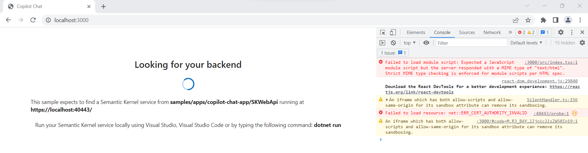

# Chat Copilot Sample Application

This sample allows you to build your own integrated large language model (LLM) chat copilot. The sample is built on Microsoft Semantic Kernel and has two applications: a front-end web UI app and a back-end API server. 

These quick-start instructions run the sample locally. To deploy the sample to Azure, please view [Deploying Chat Copilot](https://github.com/microsoft/chat-copilot/deploy/README.md).

> **IMPORTANT:** This sample is for educational purposes only and is not recommended for production deployments.

> **IMPORTANT:** Each chat interaction will call Azure OpenAI/OpenAI which will use tokens that you may be billed for.


# Requirements
You will need the following items to run the sample:

**Frontend App -** The web UI application will run on Azure.

- [Azure account](https://azure.microsoft.com/free)
- [Azure AD Tenant](https://learn.microsoft.com/azure/active-directory/develop/quickstart-create-new-tenant)
- [Registered application](https://learn.microsoft.com/azure/active-directory/develop/quickstart-register-app#register-an-application)
    - Under `Supported account types`: Select "_Accounts in any organizational directory (Any Azure AD directory - Multitenant) and personal Microsoft accounts (e.g. Skype, Xbox)_" 
    - Under `Redirect URI (optional)`: Select `Single-page application (SPA)` and set the URI to `http://localhost:3000`.
- [Application (client) ID](https://learn.microsoft.com/azure/active-directory/develop/quickstart-register-app#register-an-application)

**Backend API -** Requirements depend on your AI Service choice.

| AI Service   | Item                                                                                                                                                                                                                                                                                                                                                                                                                                                                                                                                                                                                                                                |
| ------------ | --------------------------------------------------------------------------------------------------------------------------------------------------------------------------------------------------------------------------------------------------------------------------------------------------------------------------------------------------------------------------------------------------------------------------------------------------------------------------------------------------------------------------------------------------------------------------------------------------------------------------------------------------- |
| Azure OpenAI | - [Access](https://aka.ms/oai/access)<br>- [Resource](https://learn.microsoft.com/azure/ai-services/openai/how-to/create-resource?pivots=web-portal#create-a-resource)<br>- [Deployed model](https://learn.microsoft.com/azure/ai-services/openai/how-to/create-resource?pivots=web-portal#deploy-a-model) (`gpt-35-turbo`) <br>- [Endpoint](https://learn.microsoft.com/azure/ai-services/openai/tutorials/embeddings?tabs=command-line#retrieve-key-and-endpoint) (e.g., `http://contoso.openai.azure.com`)<br>- [API key](https://learn.microsoft.com/azure/ai-services/openai/tutorials/embeddings?tabs=command-line#retrieve-key-and-endpoint) |
| OpenAI       | - [Account](https://platform.openai.com)<br>- [API key](https://platform.openai.com/account/api-keys)                                                                                                                                                                                                                                                                                                                                                                                                                                                                                                                                               |


# Setup Instructions
## Windows
1. Open PowerShell as an administrator.
2. Configure environment.

    ```powershell
    cd <path to chat-copilot>\scripts\
    .\Install.ps1
    ```

    > NOTE: This script will install `Chocolatey`, `dotnet-7.0-sdk`, `nodejs`, and `yarn`.

3. Configure Chat Copilot.
  
      ```powershell
    .\Configure.ps1 -AIService {AI_SERVICE} -APIKey {API_KEY} -Endpoint {AZURE_OPENAI_ENDPOINT} -ClientId {AZURE_APPLICATION_ID} 
    ```

    - `AI_SERVICE`: `AzureOpenAI` or `OpenAI`.
    - `API_KEY`: The `API key` for Azure OpenAI or for OpenAI.
    - `AZURE_OPENAI_ENDPOINT`: The Azure OpenAI resource `Endpoint` address. Omit `-Endpoint` if using OpenAI.
    - `AZURE_APPLICATION_ID`: The `Application (client) ID` associated with the registered application.

4. Run Chat Copilot locally. This step starts both the backend API and frontend application.
    
    ```powershell
    .\Start.ps1 
    ```

    > **IMPORTANT:** Confirm pop-ups are not bocked and you are logged in with the same account used to register the application.
    
    > **NOTE** It may take a few minutes for Yarn packages to install on the first run.

## Debian/Ubuntu Linux
1. Open Bash as an administrator.
2. Configure environment.
  
    ```bash
    cd <path to chat-copilot>/scripts/
    chmod +x *.sh

    ./Install-apt.sh
    ```

    > NOTE: This script uses `apt` to install `dotnet-sdk-7.0`, `nodejs`, and `yarn`.

3. Configure Chat Copilot.

    ```bash
    ./Configure.sh --aiservice {AI_SERVICE} --apikey {API_KEY} --endpoint {AZURE_OPENAI_ENDPOINT} --clientid {AZURE_APPLICATION_ID} 
    ```

    - `AI_SERVICE`: `AzureOpenAI` or `OpenAI`.
    - `API_KEY`: The `API key` for Azure OpenAI or for OpenAI.
    - `AZURE_OPENAI_ENDPOINT`: The Azure OpenAI resource `Endpoint` address. Omit `--endpoint` if using OpenAI.
    - `AZURE_APPLICATION_ID`: The `Application (client) ID` associated with the registered application.

4. Run Chat Copilot locally. This step starts both the backend API and frontend application.

    ```bash
    ./Start.sh
    ```

    > **IMPORTANT:** Confirm pop-ups are not bocked and you are logged in with the same account used to register the application.

    > **NOTE** It may take a few minutes for Yarn packages to install on the first run.

5. When finished, terminate the backend API process.

    ```powershell
    pkill "CopilotChatWebA"
    ```

## macOS
1. Open Bash as an administrator.
2. Configure environment.

    ```bash
    cd <path to chat-copilot>/scripts/
    chmod +x *.sh

    ./Install-brew.sh
    ```

    > NOTE: This script uses `homebrew` to install `dotnet-sdk`, `nodejs`, and `yarn`.

3. Configure Chat Copilot.

    ```bash
    ./Configure.sh --aiservice {AI_SERVICE} --apikey {API_KEY} --endpoint {AZURE_OPENAI_ENDPOINT} --clientid {AZURE_APPLICATION_ID} 
    ```

    - `AI_SERVICE`: `AzureOpenAI` or `OpenAI`.
    - `API_KEY`: The `API key` for Azure OpenAI or for OpenAI.
    - `AZURE_OPENAI_ENDPOINT`: The Azure OpenAI resource `Endpoint` address. Omit `--endpoint` if using OpenAI.
    - `AZURE_APPLICATION_ID`: The `Application (client) ID` associated with the registered application.

3. Run Chat Copilot locally. This step starts both the backend API and frontend application.

    ```bash
    ./Start.sh
    ```

    > **IMPORTANT:** Confirm pop-ups are not bocked and you are logged in with the same account used to register the application.

    > **NOTE** It may take a few minutes for Yarn packages to install on the first run.
    
# Troubleshooting

1. **_Issue:_** Unable to load chats. 
   
    _Details_: interaction_in_progress: Interaction is currently in progress._ 

    _Explanation_: The WebApp can display this error when the application is configured for a different AAD tenant from the browser, (e.g., personal/MSA account vs work/school account). 
    
    _Solution_: Either use a private/incognito browser tab or clear your browser credentials/cookies. Confirm you are logged in with the same account used to register the application.

2. **_Issue:_**: Challenges using text completion models, such as `text-davinci-003`

    _Solution_: For OpenAI, see [model endpoint compatibility](https://platform.openai.com/docs/models/model-endpoint-compatibility) for
    the complete list of current models supporting chat completions. For Azure OpenAI, see [model summary table and region availability](https://learn.microsoft.com/azure/ai-services/openai/concepts/models#model-summary-table-and-region-availability).

3. **_Issue:_** Localhost SSL certificate errors / CORS errors

    

    _Explanation_: Your browser may be blocking the frontend access to the backend while waiting for your permission to connect. 
    
    _Solution_:
    
    1. Confirm the backend service is running. Open a web browser and navigate to `https://localhost:40443/healthz`
       - You should see a confirmation message: `Healthy`
       - If your browser asks you to acknowledge the risks of visiting an insecure website, you must acknowledge this before the frontend can connect to the backend server. 
    2. Navigate to `http://localhost:3000` or refresh the page to use the Chat Copilot application.

4. **_Issue:_** Yarn is not working.

    _Explanation_: You may have the wrong Yarn version installed such as v2.x+.

    _Solution_: Use the classic version.

    ```bash
    npm install -g yarn
    yarn set version classic
    ```

5. **_Issue:_** Missing `/usr/share/dotnet/host/fxr` folder.

    _Details_: "A fatal error occurred. The folder [/usr/share/dotnet/host/fxr] does not exist" when running dotnet commands on Linux.

    _Explanation_: When .NET (Core) was first released for Linux, it was not yet available in the official Ubuntu repo. So instead, many of us added the Microsoft APT repo in order to install it. Now, the packages are part of the Ubuntu repo, and they are conflicting with the Microsoft packages. This error is a result of mixed packages. ([Source: StackOverflow](https://stackoverflow.com/questions/73753672/a-fatal-error-occurred-the-folder-usr-share-dotnet-host-fxr-does-not-exist))

    _Solution_:

    ```bash
    # Remove all existing packages to get to a clean state:
    sudo apt remove --assume-yes dotnet*;
    sudo apt remove --assume-yes aspnetcore*;
    sudo apt remove --assume-yes netstandard*;

    # Set the Microsoft package provider priority
    echo -e "Package: *\nPin: origin \"packages.microsoft.com\"\nPin-Priority: 1001" | sudo tee /etc/apt/preferences.d/99microsoft-dotnet.pref;

    # Update and install dotnet
    sudo apt update;
    sudo apt install --assume-yes dotnet-sdk-7.0;
    ```