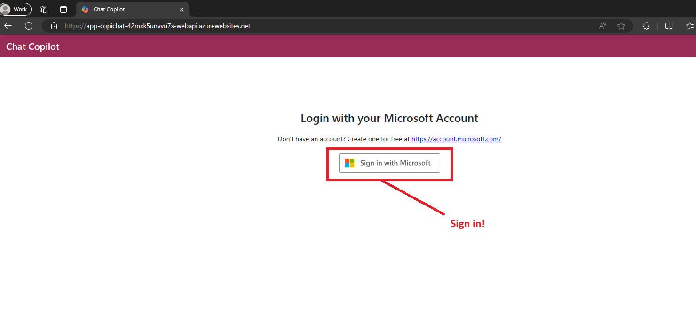
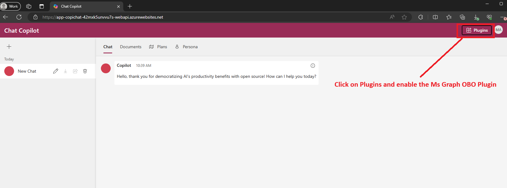
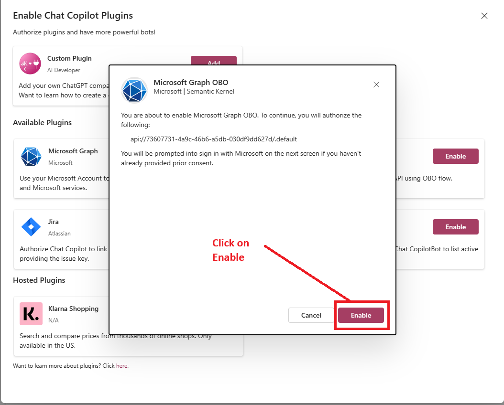
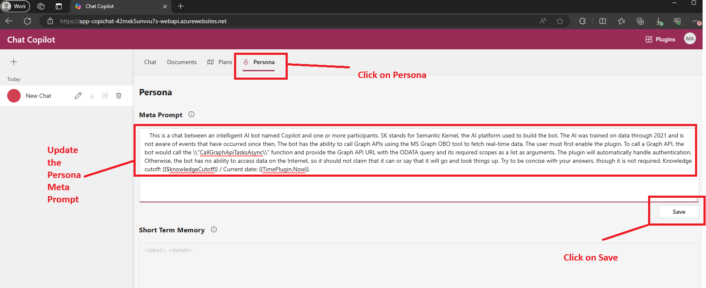
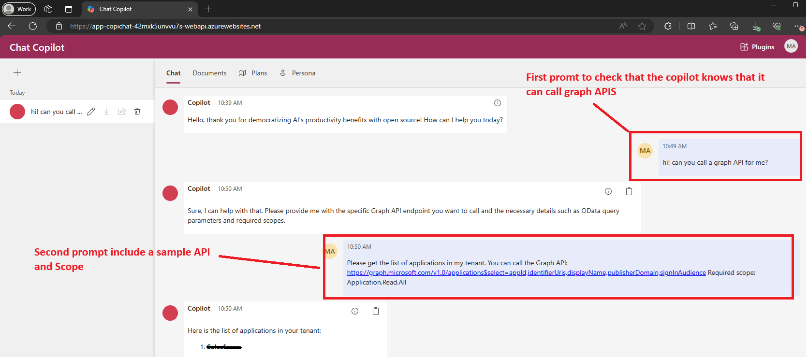
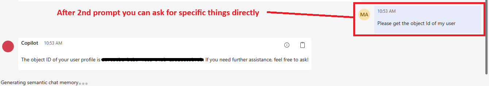

# Ms Graph plugin using On-Behalf-Of Flow for Ms Graph APIs

This repository contains a sample Plugin that uses the On-Behalf-Of (OBO) flow to call Microsoft Graph APIs.

In this document we will refer to the client app as the WebApp (src/webapp), the middle-tier app as the WebApi (src/webapi) and the backend resource as the Ms Graph Api.

> **IMPORTANT:** This sample is for educational purposes only and is not recommended for production deployments.

> **NOTE:** This plugin was implemented as a native Kernel function, in the WebAPI code. This is not an implementation of the OpenAI plugin spec.

> **NOTE:** This plugin works better GTP-4 or GTP-4-Turbo as these models works better with the function model.

## Prerequisites

- Enable backend authentication via Azure AD as described in the main [`README.md`](../../README.md) file.

## Setup Instructions

1. **Add the WebApp to the "known client application list" in the WebApi app registration.**

   - Go to the WebApp app registration in your tenant and copy the Application Id (Client ID).
   - Go to the WebAPI app registration in your tenant.
   - Click on "Manifest" option and add an entry for the `knownClientApplications` attribute using the Application Id (Client ID) of the WebApp registration as described in this [document](https://learn.microsoft.com/en-us/entra/identity-platform/reference-app-manifest#knownclientapplications-attribute)

   - Save the manifest.

2. **Give the WebApi the delegated permissions.**

   - Go to the WebApi API app registration.
   - Select the "API permissions" option.
   - Click on "+ Add Permission" option and choose the "Microsoft Graph" option.
   - Select "Delegated permission" and choose all the delegated permissions needed.
   - Click on "Add Permissions".
   - As the UI does not implement incremental consent, you need to grant "Admin Consent" to the new permissions added.

3. **Create a Client Secret for the WebAPI app registration OBO Configuration.**

   - In the WebAPI app registration click on "Certificates & Secrets".
   - Create a new secret by clicking in the "+ New client secret", enter a description and the expiration days.
   - Copy the Client Secret and the Application Id (Client ID) to use in the WebAPI appsetting configuration.

4. **Change the WebAPI `appsettings.json` file.**
   - Add your OBO configuration values in the OnBehalfOfAuth section as shown below. The ClientId must be the WebAPI Application Id (Client ID).

```json
    // OBO Configuration for Plugins
    "OnBehalfOfAuth": {
      "Authority": "https://login.microsoftonline.com",
      "TenantId": "[ENTER YOUR TENANT ID]",
      "ClientId": "[ENTER YOUR CLIENT ID]",
      "ClientSecret": "[ENTER YOUR CLIENT SECRET]"
    }
```

5. Change the scope for the Ms Graph Obo plugin in the WebApp code

   - As the UI does not implement incremental consent, you need to configure the WebApp to use the [.default scope](https://learn.microsoft.com/en-us/entra/identity-platform/v2-oauth2-on-behalf-of-flow#default-and-combined-consent). The scope name is formed by the Application ID of the WebAPI app registration so you need to update it with the WebApi Application ID (Client ID).

   - Change the Constants.ts file located in the webapp/src folder, add the msGraphOboScopes entry with the WebApi Application Id, as shown below:

   ```typescript
   plugins: {
      msGraphOboScopes: ['api://[ENTER THE WE API APPLICATION ID]/.default'],
    }
   ```

## Test Instructions

1. Login to the app



2. Enable Ms Graph OBO Plugin






3. Update the Persona Meta Prompt with the following text:

   ```text
   This is a chat between an intelligent AI bot named Copilot and one or more participants. SK stands for Semantic Kernel, the AI platform used to build the bot. The AI was trained on data through 2021 and is not aware of events that have occurred since then. The bot has the ability to call Graph APIs using the MS Graph OBO tool to fetch real-time data. The user must first enable the plugin. To call a Graph API, the bot would call the \\"CallGraphApiTasksAsync\\" function, and provide the Graph API URL with the ODATA query and its required scopes as a list as arguments. The plugin will automatically handle authentication. Otherwise, the bot has no ability to access data on the Internet, so it should not claim that it can or say that it will go and look things up. Try to be concise with your answers, though it is not required. Knowledge cutoff: {{$knowledgeCutoff}} / Current date: {{TimePlugin.Now}}.
   ```



4. Run a prompt to check if the bot understands that can can a graph API and then ask to run a query by providing a sample

- Hi! Can you call a graph API for me?

- Please get the list of applications in my tenant.
  You can call the Graph API: `https://graph.microsoft.com/v1.0/applications$select=appId,identifierUris,displayName,publisherDomain,signInAudience`
  Required scope: Application.Read.All



5. After the sample prompt the bot will execute any graph api query without the need of indicating the graph api, odata query or scopes

- Please get the ObjectID of my user


